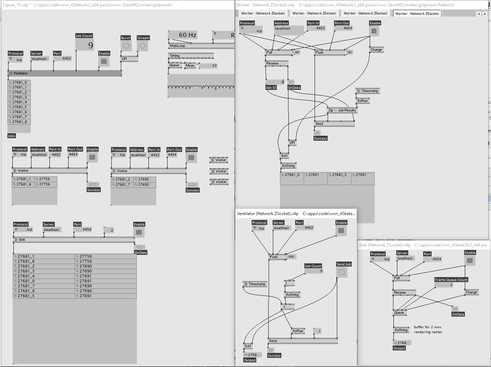

Introduction
============

This node pack wraps the functionality of [NetMQ](https://github.com/zeromq/netmq) ([intro](http://netmq.readthedocs.org/en/latest/introduction/)), the native c# implementation of the original ØMQ, which now obviously put vvvv's networking capabilities on steroids. 

It implements all available ZSocket types as nodes and provides uniform send/receive functionality. Multicore is a key feature for all of them.

It allows safe messaging of Raw data between vvvv instances (local and remote) and removes problems with TCP (receive any package the way you sent it, and in proper order from that client) and UDP (packages don't drop because the network is busy) by utilizing efficient handshaking and queueing. For Pros, it allows smooth async partitioning the likes of services, input handlers, database lookups, and even output driving (like good old boygrouping).

For starters, I'd recommend trying Dealer/Router pattern, or if it is more to your purpose: Publisher/Subscriber. When you know the differences, go experiment with the others, sometimes they add just the functionality you've been missing. Just don't start with Request/Response, it's a trap.

TCP and Inproc work solid so far, for quick messaging and even streaming video data. 

Configuration of Sockets can be managed with Option nodes, and Context can be set manually for each ZSocket. Everything spreads beautifully, as you would expect it from a vvvv pack in 2015. When interfacing with another language, vvvv's unique interface puts you in a prime position.

Notes
=====

For a in-depth introduction to ZeroMQ (and merry-go-around in general distributed architecture), consult the great [zqm Guide](http://zguide.zeromq.org/page:all).
Note that most examples can be patched along with the guide. Whether to Bind or Connect a socket is up to you (see Herr Inspektor), but defaults have been geared for the basic use. 

Be not afraid to experiment, the following is what was found

 * Never bind two ZSockets to the same endpoint (protocol://address[:port])
 * When using InProc, you'll see connecting clients in red until you bind a fit socket. They have to be in the same vvvv instance and sharing the same Context.
 * Subscribers don't behave well with a disconnect from Publisher. Re-Enable helps.
 * PGM has not been tested much, as it needs admin rights for vvvv and some tinkering with windows. Maybe even special network hardware?
 * When redesigning ZSockets, vvvv can become unstable, especially when Sockets are still enabled. I guess that's toward the crash-early philosopy of ØMQ. Save before changing the Protocol.

On the sunny side: Connecting many clients to one server port and doing reliable 1:1 communication is a breeze, and with the Sockets provided even easier to get at stormy speed.

Ideas to go Further
===================

 * compiling it at your machine
 * adding and testing remaining Options in nodes 
 * substituting help patches for sockets with wise knowledge about funny rl use-cases, technical particularities, and references to girlpower or patterns
 * adding Monitoring capabilities
 * designing higher-level convenience HeartBeat patches
 * and ofc adding nice stuff to the /girlpower folder

Ask for help at the vvvvorum, or mail: marko [äd] intolight.de
For a quick skype please use velcrome@jabber.ccc.de or find help in freenode irc channel ##vvvv.

Credits
=======

Author
------
Marko Ritter (www.intolight.de)

Nuget
----
* [VVVV-sdk](https://github.com/vvvv/vvvv-sdk), LGPL
* [NetMQ](https://github.com/zeromq/netmq), LGPL 3

License
=======

, LGPL 3

